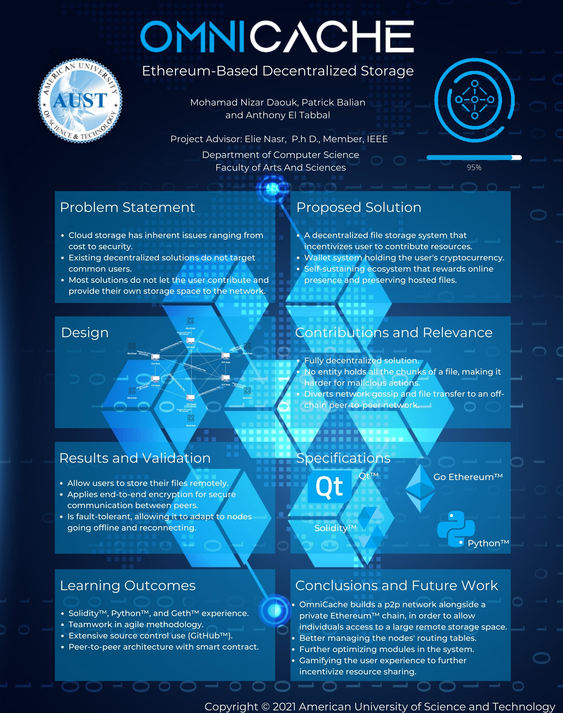

# Bs Computer Science Senior Project: OmniCache

### Abstract
**Purpose** - This project presents an approach to provide a decentralized, scalable, fault-tolerant, and secure file storage service using Blockchain Technology.

**Approach** - “OmniCache's basic premise is to share a file across a Peer-to-Peer (P2P) network and track the encryption, storage, retrieval, and contract administration using a Blockchain.  “Omnies” is the cryptocurrency transacted by lenders and renters of storage, which enables users to pay for storing files on nodes of the same network. 

**Findings** - Based on this approach, a Blockchain-based distributed storage service available as a desktop software and implemented in Python is developed. This project utilizes Go Ethereum™ as the Blockchain platform, Solidity and Remix for developing Ethereum™ smart contracts. PyQT was used to implement the graphical user interface in an effort to make the interface more user friendly. 

**Practical implications** - OmniCache enables users to have access to an anonymous and secure way for individuals to store their files as well as offering an ever-growing remote storage capacity. In addition, users that are perpetually investing resources in the network are given incentive to continue doing so. Users with unused free storage space can profit by renting the space to other peers on the network. Omnies that are granted can be used to store more files on the network.

More information can be found in [OmniCache_Report.docx](https://github.com/Goldenboycoder/OmniCache/blob/main/Report/OmniCache_Report.pdf)

### Contributors
* Nizar1999
* atabball
